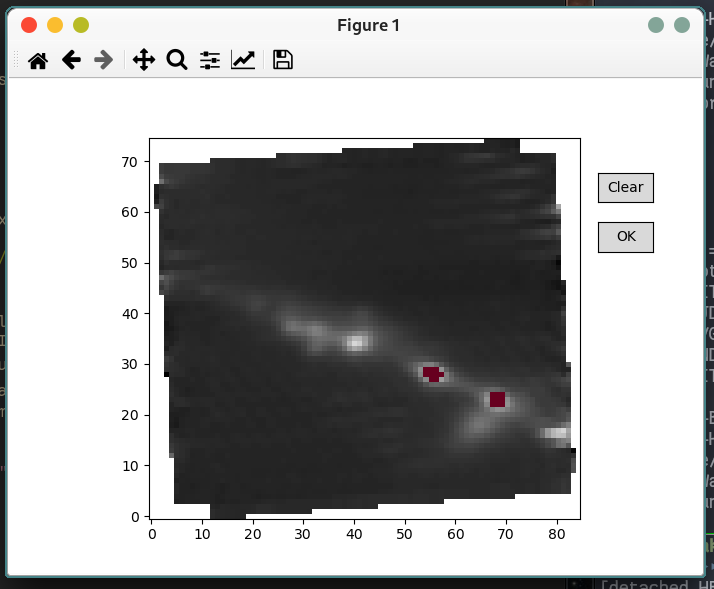

# IFU-tools

Various python convenience code to work with (primarily JWST/NIRSpec) IFU data.

## Dependencies and installation

### Dependencies

Python dependencies are:

- **NumPy**
- **Matplotlib**
- **AstropPy**

### Installation

For now, just download the file and place it either in your working directory or
somwehere in you `PYTHON_PATH` (this can be checked in a Linux/Mac/Unix shell
using `echo $PYTHON_PATH`). 


## Pick spaxels and extract a spectrum

The file `pick-and-extract.py` contains the class `ExtractSPectrum`, which
allows one to interactively select spaxels from an IFU datacube, and extract a
combined spectrum from these pixels. 

### Usage

#### Simple example:

``` python
from pick-and-extract import SpecExtractor

specslector = SpecExtractor("/path/to/ifu/cube.fits")
```

Now, a Matplotlib plot window should show up showing a median image of the
datacube along the spectral axis. It is now possible to select and deselect
individual pixels with a simple mouse click. The `Reset` butten does what it
says: Clears the selection. When happy with the selection, the `OK` button
extracts and coadds a spectrum from the selected pixels. 

This spectrum can then be accessed by using the method
`specselector.save_spectrum("/path/to/outputfile")`. 



