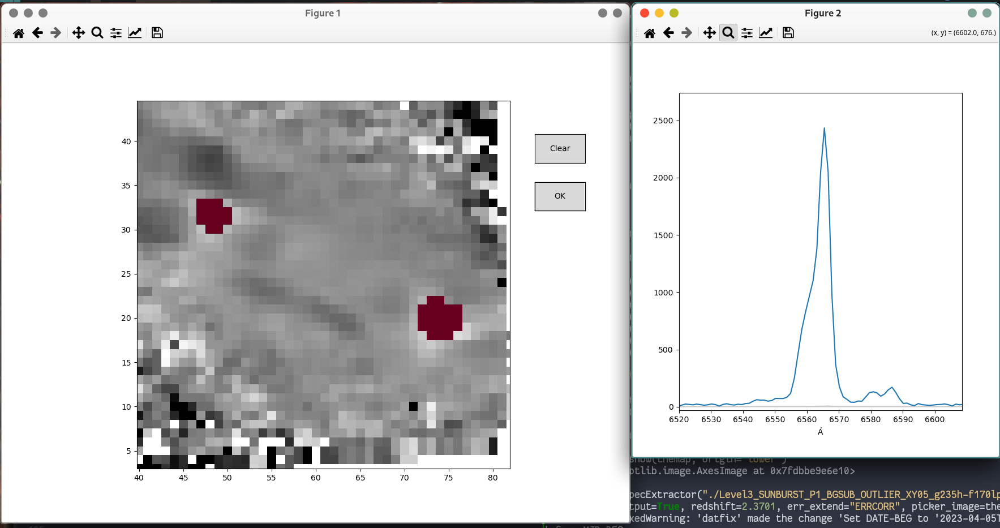

# IFU-tools

Various Python convenience code to work with (primarily JWST/NIRSpec) IFU data.

## Dependencies and installation

### Dependencies

This module depends on the following Python packages:

- **NumPy**
- **Matplotlib**
- **AstropPy**

### Installation

For now, just download the file and place it either in your working directory or
somwehere in you `PYTHON_PATH` (this can be checked in a Linux/Mac/Unix shell
using `echo $PYTHON_PATH`). 


## Pick spaxels and extract a spectrum

`SpecExtractor` is a simple graphical interface to interactively select spaxels
(SPAtial piXELS) of an IFU datacube, and extract a coadded spectrum from these
spaxels. The spectrum is coadded as a simply sum, and the errors are summed in
quadrature. 

The class is in the file `pick-and-extract.py`, and a simple example of
use is: 

``` python
from pick-and-extract import SpecExtractor

ex = SpecExtractor("/path/to/ifu/cube.fits")
```

Now, a Matplotlib plot window should show up showing a median image of the
datacube along the spectral axis. It is now possible to select and deselect
individual pixels with a simple mouse click. The `Reset` butten does what it
says: Clears the selection. When happy with the selection, the `OK` button
extracts and coadds a spectrum from the selected pixels. 

 


### Accessing and saving the extracted spectrum

This spectrum can then be accessed by using the method `ex.get_spectrum()`,
which will return the latest extracted spectrum as an `astropy.table.Table`; and
it can be conveniently saved calling `ex.save_spectrum("/path/to/outputfile")`
(or just using the usual `write()` method of the astropy Table).

### Using an arbitrary picker image
One may want to pick spaxels based on other criteria than just the median
continuum of the cube, such as the local properties of some astrophysical
diagnostic or similar. 

It is possible to pass `SpecExtractor` an arbitrary image to display when
picking spaxels to extract, using the `picker_image` keyword argument. The image
must be in the shape of a 2D Numpy array of the same pixel size as the celestial
dimensions of the data cube. 


### More options
Other simple keyword arguments when are:

- `sci_extend`, `err_extend`: Names or numbers of the FITS extensions containing
  the flux and error data. Defaults to "SCI" and "ERR". Errors are assumed to be
  standard errors.
- `celestial_coordinates`: Set to `True` to show celestial coordinates on the
  picker figure, lifted from the header of the datacube file.
- `plot_output`: Setting this to `True` will automatically open a plot window
  of the extraced spectrum when the `OK` button is pressed.
- `redshift`: The optional redshift of the object. This will ensure that the
  `restwave` array is correct (redshift defaults to 0). This mainly affects the
  display of the plot of the spectrum.
- `norm`: Color normalization for the picker image. Can either be a string or a
  normalization object understood by Matplotlib. Defaults to using
  `astropy.visualization.simple_norm` with `stretch="sqrt"`, and `vmin` and
  `vmax` set to the 5th and 95th percentile of the picker image data. 
- `cmap`: The colormap to use for the picker image. Defaults to `gist_gray`.


### A more complex example

Here is an example using more of the optional arguments: 

``` python
from IFU-tools.pick_and_extract import SpecExtractor

spex = SpecExtractor(
    "/path/to/datacube.fits", picker_image=my_np_array, celestial_coordinates=False,
    plot_output=True, redshift=1.452
)
```
which, with a test dataset, looks like this:

 
